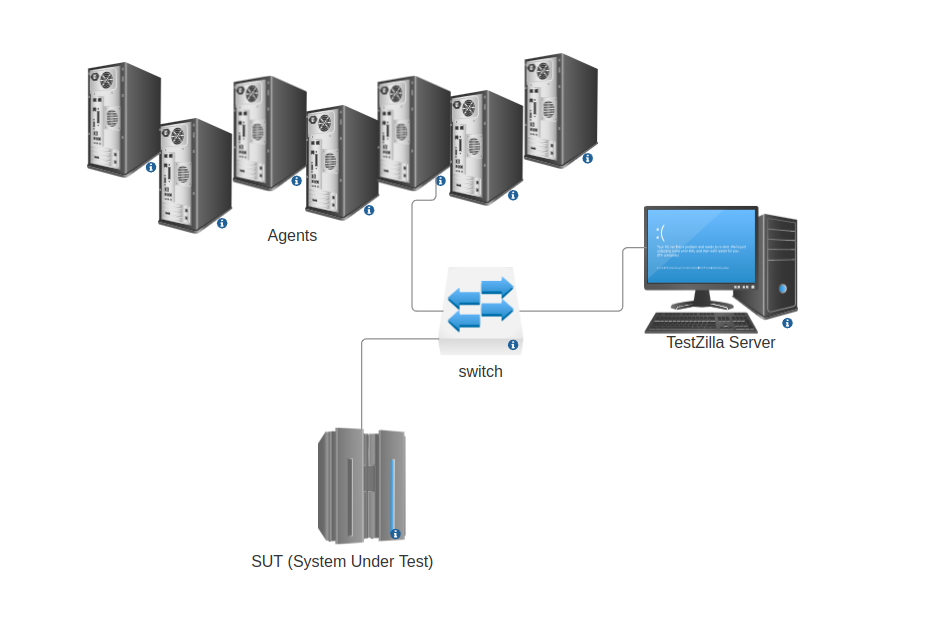

# 🦖 TestZilla 
TestZilla is a test  & benchmark framework, written in Golang, initially forked from [Plow](https://github.com/six-ddc/plow). TestZilla is under development. 
- [x] Generate 1000,000 RPS in your Home-Made Lab

❤️  TestZilla is free and will be free forever to use because of donations from people like you.[Click here for support](mailto:khaleghsalehi@gmail.com)

# About 

TestZilla is a distributed solution for stress test and benchmarks on Application Services, APIs, Web Servers and Network Protocols. TestZilla is currently under development, and its initial version is focused on Web Application Services and REST API. In TestZilla's development, we are trying to provide you with a home-based and cost-effective solution for setting up a benchmark lab. The goal is to create-N * 1000,000 RPS at your homemade lab. Currently, there are many open source solutions for stress testing and benchmarking in the open source community, thanks to all of them. We are trying to provide all the functional features of these tools in the form of a unique solution.
# Test scenario
Suppose we have a number of machine  in our laboratory, and we want to generate 1000000 http RPS. If each machine can generate 50K requests, we need 1+20 machines. One machine to deploy TestZilla in server mode and 20 other machines to distribute Agents, follow the steps below step by step to perform this test scenario.

1- On all machines, install linux  (preferably Ubuntu Server) with SSH service  (SSH authentication with same username and password)

2- If possible, tune the TCP stack of all nodes for better test performance

3- Consider one of the machines as a TestZilla server, download the TestZilla project from GitHub  and compile it with the relevant commands according to the guide in the readme of the project.

4- On the server machine, run TestZilla in server mode and enter the system dashboard via http://server_ip:9090

5- In the New Test form, in the IP List section, enter the addresses of all other server IP (comma separated, e.g. **192.168.1.2,192.168.1.3** ) that have the role of Agent and start the test.

6- The report related to the Test Operation of all agents will be available in report form.

# Component & Modules
The TestZilla architecture is monolithic.

# Dependency 
 - PostgresSQL
 - Golang 1.22.0 (and up)

# Compile & Usage
Follow the steps below to compile and run TestZilla:

 -  PostgresSQL database "tz"
 -  PostgresSQL username  "testzilla" with super admin privilege
 -  PostgresSQL password  "123456"

Run commands below step by step:

``
chmod +x run.sh
``

then

``
./run.sh
``

 all done.
 Now you can open your browser and enter Testzilla dashboard by entering the following address.

[http://localhost:9090](http://localhost:9090)

 
# Web Dashboard

